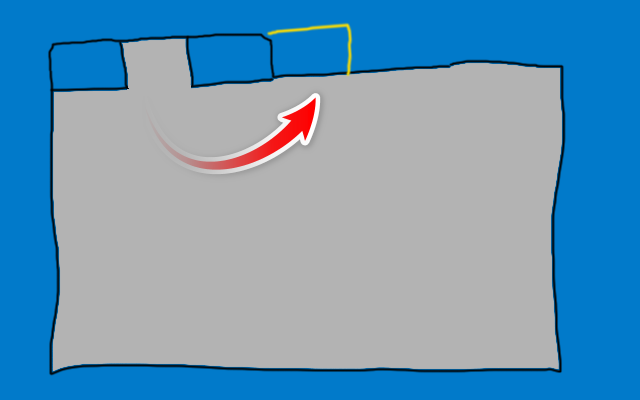

[English version / sivu englanniksi](#new-tabs-last)

# Uusi välilehti viimeiseksi

Selainlisäosa Chromium-pohjaisiin selaimiin. Lisäosa pyrkii sijoittamaan uudet välilehdet aina viimeiseksi.

<figure>

<figcaption><em>Olen myös taiteilija!</em></figcaption>
</figure>
<br>
<br>
Lisäosan koko lähdekoodi on tässä - yksi rivi:

```javascript
chrome.tabs.onCreated.addListener(newTab => chrome.tabs.move(newTab.id, { 'index': -1 }))
```

Manifest-tiedosto on version 3 mukainen, eikä lisäosa tarvitse mitään erityisiä oikeuksia.

## Asennus

Asenna lisäosa Microsoft Edgen lisäosakaupasta tai Chromen Web Storesta. Voit asentaa sen myös manuaalisesti pakkaamattomana lisäosana.

<table>
<tr>
<td><a href="https://microsoftedge.microsoft.com/addons/detail/hnkpimhfefmjmdgklhkdbfjdjhnnphia"> Microsoft Edge -lisäosat</a></td>
<td><a href="https://chrome.google.com/webstore/detail/gpgdcpgidlmofalipnkeemjhodchghko"> Chrome Web Store</a></td>
</tr>
</table>

<br>

---

<br>

# New tabs last

Browser extension for Chromium based browsers. This extension tries to place newly opened tabs at the end.

<figure>

<figcaption><em>I'm also an artist!</em></figcaption>
</figure>
<br>
<br>
The full source code for the extension is here - one line:

```javascript
chrome.tabs.onCreated.addListener(newTab => chrome.tabs.move(newTab.id, { 'index': -1 }))
```

The manifest file for the extension is version 3. No special permissions needed.

## Installation

Install this extension from Microsoft Edge Add-ons website or Chrome Web Store. You can also install it manually as an unpacked extension.

<table>
<tr>
<td><a href="https://microsoftedge.microsoft.com/addons/detail/hnkpimhfefmjmdgklhkdbfjdjhnnphia"> Microsoft Edge Add-ons</a></td>
<td><a href="https://chrome.google.com/webstore/detail/gpgdcpgidlmofalipnkeemjhodchghko"> Chrome Web Store</a></td>
</tr>
</table>
